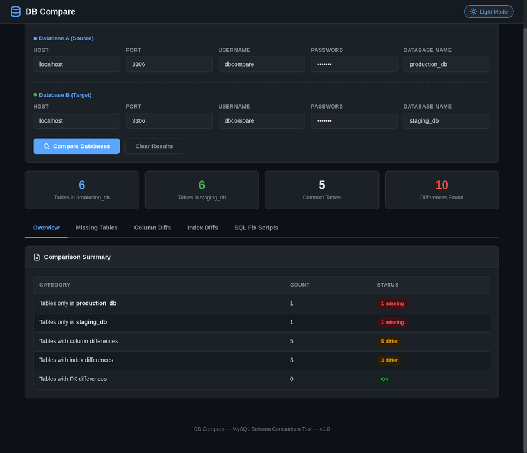
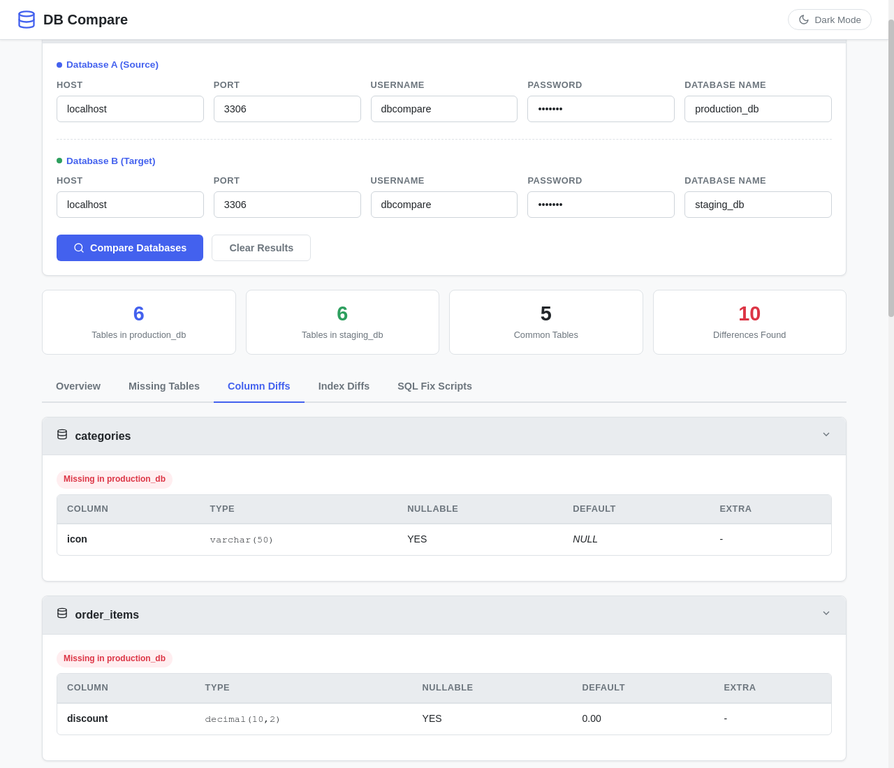
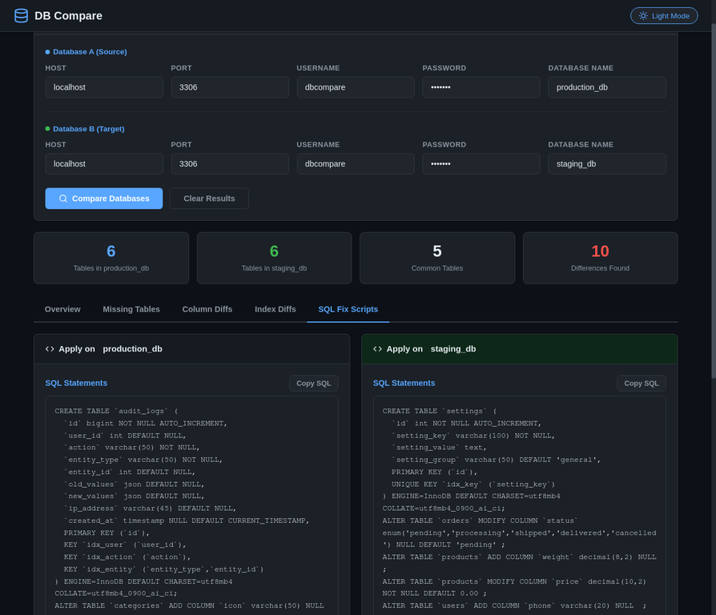

# DB Compare - MySQL Schema Comparator

DB Compare is a lightweight, pure-PHP utility designed to compare the schemas of two MySQL databases side-by-side. It detects differences in tables, columns, indexes, and foreign keys, and automatically generates the SQL statements required to synchronize them.

This tool features a modern, interactive HTML interface with built-in dark and light mode support (auto-detects system preference), making it easy for developers to review differences and apply fixes.

## 📸 Screenshots

### Overview Results (Dark Mode)


### Column Differences (Light Mode)


### Auto-Generated SQL Fix Scripts


## ✨ Key Features

- **Comprehensive Schema Comparison**: Accurately compares tables, columns, indexes, and foreign keys between two databases.
- **Smart SQL Fix Generation**: Automatically generates `ALTER TABLE` and `CREATE TABLE` statements to make the schemas identical.
- **Interactive UI**: A clean, responsive interface built with HTML, CSS, and JavaScript.
- **System-Aware Dark/Light Mode**: Built-in theme toggling that automatically respects your OS preference for comfortable viewing in any environment.
- **AJAX-Powered**: Performs comparisons asynchronously without page reloads for a smooth experience.
- **One-Click Copy**: Easily copy generated SQL scripts to your clipboard with a single click.
- **Zero Dependencies**: Requires only PHP with the PDO MySQL extension. No external libraries or Composer packages needed.

## 📋 Requirements

- PHP 7.4 or higher
- PDO MySQL extension (`ext-pdo_mysql`)
- A web server (Apache, Nginx, PHP Built-in Server)

## 🚀 Installation

1. Clone or download this repository to your web server's document root.
2. Ensure the directory is accessible via your web browser.
3. No `composer install` is required, though a `composer.json` is provided for project metadata.

## 💻 Usage

1. Open the project directory in your web browser (e.g., `http://localhost/db-compare/`).
2. Fill in the connection details for **Database A** (Source) and **Database B** (Target).
3. Click the **Compare Databases** button.
4. Review the results in the interactive tabs:
   - **Overview**: A summary of the differences found.
   - **Missing Tables**: Tables that exist in one database but not the other.
   - **Column Diffs**: Differences in column definitions (type, nullability, defaults).
   - **Index Diffs**: Differences in indexes and unique constraints.
   - **SQL Fix Scripts**: The generated SQL statements to synchronize the databases.
5. Copy the required SQL statements and execute them on your target database.

> **Warning**: Always back up your databases before executing generated SQL scripts. The tool focuses on schema structure; row-level data comparison is outside its scope.

## 📁 Project Structure

```text
db-compare/
├── api.php                 # API endpoint handling AJAX comparison requests
├── index.html              # Main interactive user interface
├── index.php               # Legacy fallback entry point
├── composer.json           # Project metadata
├── .htaccess               # Apache configuration for security
├── src/
│   ├── DbConnection.php       # PDO wrapper and schema querying logic
│   └── DatabaseComparator.php # Core comparison and SQL generation logic
├── assets/
│   ├── css/
│   │   └── style.css       # Stylesheet with dark/light mode variables
│   └── js/
│       └── app.js          # Frontend logic, form handling, and rendering
└── screenshots/            # Documentation images
```

## 🔒 Security Considerations

This tool is designed for development and staging environments. **Do not expose this tool on a public-facing production server without strict authentication.** It requires database credentials and exposes schema information, which poses a significant security risk if accessed by unauthorized users.

## 📄 License

This project is open-source and available under the MIT License.
